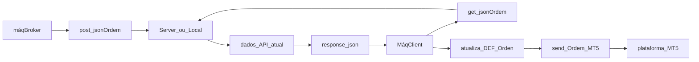

<h1>Adapt4_invest<p>
  <h3> Uma das iniciativas da empresa <a href="http://www.adapt4.com.br"> Empresa adapT4 </a> é trazer a expertise e conhecimento de operações do mercado financeiro para pequenos e médios negócios, com objetivo de captar recurso financeiros e sustentar seu core bussines </h3>
</h1> 

<h2> Operacional </h2>
<div> <strong>Futuros</strong> com WDO, WIN, CCM == primeiras operações diárias com meta de 0,01 a 0,03 centavos/dia </div>
<div> <strong>Position</strong> com AÇÕES brasileiras == systema de recomendação em desenvolvimento... </div>
</h3>

<h2> Requisitos </h2>
  <ol>
    <li> Máquina Local com instalação (python + VScode + MT5) </li>
    <li> Login e senha do cliente (plataforma contratada na corretora do cliente) </li>
    <li> API conectada </li>
    <li> Apuração de ganhos </li>
    <li> Conta para receber (30% performace) </li>   
  </ol>  
<h2>

pip insall pandas requests json MetaTrader5
pip freeze > requirements.txt
</h2>

<details>
     <summary> FLOW API SERVER<>CLIENT </summary>
    

</details>
</details>

### coins digitais
[bitcoin](https://www.coingecko.com/pt/api/pricing)

### médias em python

<details>
     <summary> medias em python </summary>
    
```
mme = (price1_mme_anterior) * (2/n + 1) + mme_anterior
n   = periódos
mme = média móvel exponencial

medias simples == .rolling
medias expon == .ewn

[Normalização](https://medium.com/ipnet-growth-partner/padronizacao-normalizacao-dados-machine-learning-f8f29246c12)
```

<details>
     <summary> medias em python </summary>
    
```
df[] = df.groupby('col').df[].pct_change()
df[] = df.groupby('col').df[].shift(-1)
df[] = df.groupby('data')["pontos"].rank(ascending = True (decrescente) | False (crescente)
df[df['data'] == "yyyy-mm-dd"].sort_values('rank_final').head(5)

analise >> volume de vendas e compras acumulada
analise >> soma das variações do volume (sinóide)
df[coluna] = Serie = var.to_frame()
frame[] = (1 + frame[]).cumprod() - 1
qs.extend+pandas()
frame.index = pd.to_datatime(frame.index)

### function para series temporais
[maniputando series](https://www.datacamp.com/pt/tutorial/pandas-resample-asfreq)
[GRÍFICO EM CANVA+PYTHON](https://usandopy.com/humix/video/Epl9wOYQYH2)
```
