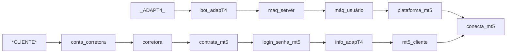

<h1>Adapt4_invest<p>
  <h3> Uma das iniciativas da empresa <a href="http://www.adapt4.com.br"> Empresa adapT4 </a> é disponibilizar a expertise e conhecimento de operações no mercado financeiro, com objetivos claro no acumulo de patrimônio </h3>
</h1> 

<h2> Operacional </h2>
<div> <strong>Futuros</strong> com WDO, WIN, CCM, BGI, BTC se utilizando de operações diárias e medindo risco inerente a volatilidade do dia </div>
<div> <strong>Posições</strong> carrecagas com AÇÕES brasileiras == systema de recomendação em desenvolvimento... </div>
</h3>

<h2> Requisitos </h2>
  <ol>
    <li> Máquina Local com instalação (python + VScode + MT5) </li>
    <li> Login e senha do cliente (plataforma contratada pelo cliente em sua corretora) </li>
    <li> Plataforma conectada em nossa sala de operação </li>
    <li> Repasse da performace do cliente para adapT </li>
    <li> Cliente recebe infome do imposto a pagar </li>   
  </ol>  
<h2>

</h2>


</details>
</details>


<details>
     <summary> medias em python </summary>
    
```

```

<details>
     <summary> medias em python </summary>
    
```

```
