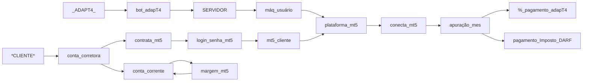

<p align="center">
 </p>
  
  <h3> Uma das iniciativas da <a href="http://www.adapt4.com.br"> Empresa </a> é disponibilizar a expertise e conhecimento de operações no mercado financeiro, com objetivos claros no acúmulo de capital. </h3>
</h1> 

<h2> Operacional </h2>
<div> <strong>Futuros</strong> com WDO, WIN, CCM, BGI, BTC, JURO se utilizando de operações diárias e medindo risco inerente a volatilidade do dia. </div>
<div> <strong>Posições</strong> em compras médias com AÇÕES brasileiras == sistema de recomendação em desenvolvimento... </div>
<div> <strong>Opções</strong> modelando em IA para agregar mais diversificação as operações. </div>
</h3>

<h2> Segurança </h2>
  <ol>
    <li> Não acessamos a sua conta corretora; </li>
    <li> Login e senha que utilizamos é da plataforma contratada pelo cliente; </li>
    <li> Utilizamos as nossas estações para cada cliente; </li>
    <li> Repasse do pagamento é feito do cliente para adapT4; </li>
    <li> Cliente recebe informe detalhado dos seus tributos a pagar. </li>   
  </ol>  
<h2>

</h2>

<h2> Fluxo de Relacionamento </h2>


</details>

 ℹ️ Aponte para o QRcode e faça seu cadastro, assim que houver vagas, entreremos em contato. <a href="https://docs.google.com/forms/d/1Z5kRrNm_CM8c7UKUxviqJqp9t9NPqXJSKko6WeKixgY/preview"> Pré cadastro </a> → 

<h2> Corretoras </h2>
# {
As 3 corretoras são as indicadas para contratar o serviço da plataforma MT5:

XP - Permitido operações de daytrade e position. Custo 0/mes ao contratar.
RICO - Permitido operações de daytrade e position. Custo 0/mes ao contratar.
TERRA - Permitido operações de daytrade e position. Custo R$ 50,00/mes ao contratar.

Órama - Foi comprada recentemente pelo BTG, deixou de fornecer ambas as modalidades de operação.
* As demais corretoras até o momento só permitem operações de daytrade. O que impacta nosso modelo operacional em determinados ativos e impacta tambem nos custo.

}
<details>
     <summary> CORRETORAS IDEAIS </summary>
    
```

```

<details>
     <summary> xxx </summary>
    
```

```
</details>
