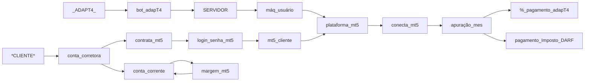

<p align="center">
 </p>
  
  <h3>  Queremos aproximar pessoas a outros instrumentos de investimento e sabemos que muitos não o fazem por medo, para isso, nossa <a href="http://www.adapt4.com.br"> Empresa </a> se utiliza de análise para medir e métodos quantitativos, enquanto você continua a sua vida e se assegura que tudo esta na sua própria conta. </h3>
  
</h1>

 ℹ️ Aponte para o QRcode e faça seu <a href="https://docs.google.com/forms/d/1Z5kRrNm_CM8c7UKUxviqJqp9t9NPqXJSKko6WeKixgY/preview"> Pré-cadastro </a> → 
 <h4> Em breve lançaremos...</h4>

<h2> Informações Acesse Whatsapp </h2>
 <a href="https://docs.google.com/forms/d/1Z5kRrNm_CM8c7UKUxviqJqp9t9NPqXJSKko6WeKixgY/preview"> </a>


<h2> Operacional </h2>
<div> <strong>Futuros</strong> com WDO, WIN, CCM, BGI, BTC, JURO se utilizando de operações diárias e medindo risco inerente a volatilidade do dia. </div>
<div> <strong>Posições</strong> em compras médias com AÇÕES brasileiras == sistema de recomendação em desenvolvimento... </div>
<div> <strong>Opções</strong> modelando em IA para agregar mais diversificação as operações. </div>
</h3>

<h2> Segurança </h2>
  <ol>
    <li> Não acessamos a sua conta corretora; </li>
    <li> Login e senha que utilizamos é da plataforma contratada pelo cliente; </li>
    <li> Utilizamos as nossas estações para cada cliente; </li>
    <li> Repasse do pagamento é feito do cliente para adapT4; </li>
    <li> Cliente recebe informe detalhado dos seus tributos a pagar. </li>   
  </ol>  
<h2>

</h2>

<h2> Fluxo de Relacionamento </h2>


</details>

<h2> Corretoras </h2>
    Corretoras indicadas para contratar plataforma MT5:
    
    XP - Permitido operações de daytrade e position. Custo 0/mes ao contratar.
    RICO - Permitido operações de daytrade e position. Custo 0/mes ao contratar.
    TERRA - Permitido operações de daytrade e position. Custo R$ 50,00/mes ao contratar.
    
    Órama - Foi comprada recentemente pelo BTG, deixou de fornecer ambas as modalidades de operação.
    * As demais corretoras até o momento só permitem operações de daytrade. O que impacta nosso modelo operacional em determinados ativos e impacta tambem nos custo.

<details>
     <summary> Contratar e Editar limite na plataforma </summary>
    
```
XP
> Em [Menu] acesse [Produtos] → Renta Variável → Plataformas e Serviços:
  > Nas [Guias] selecione [Automação] → Escolha o card MetaTrader 5 → Click em [Contratar].  *ATENÇAO*, não escolha (simulador)
> No card do MetaTrader 5 click em [Gerenciar] → Click Alterar limites → Indique o valor de limite → Click [Continuar]. Deve exigir sua senha de assinatura!
  > *ATENÇAO*, você deve possuir Saldo na conta investimento!

RICO
> Em [Menu] acesse [Opera na bolsa] → Click em Plataformas de Negociação:
  > Pesquise por meta → Plataformas e Serviços → No card MetaTrader 5 → Click em [Contratar].  *ATENÇAO*, não escolha (simulador)
> No card do MetaTrader 5 click no 3 pontos → Click Editar limits → Indique o valor de limite → Click [Continuar]. Deve exigir sua senha de assinatura!
 > *ATENÇAO*, você deve possuir Saldo na conta investimento!


```
</details>

<details>
     <summary> Custos operacionais nas corretoras </summary>
    
```

```
</details>
